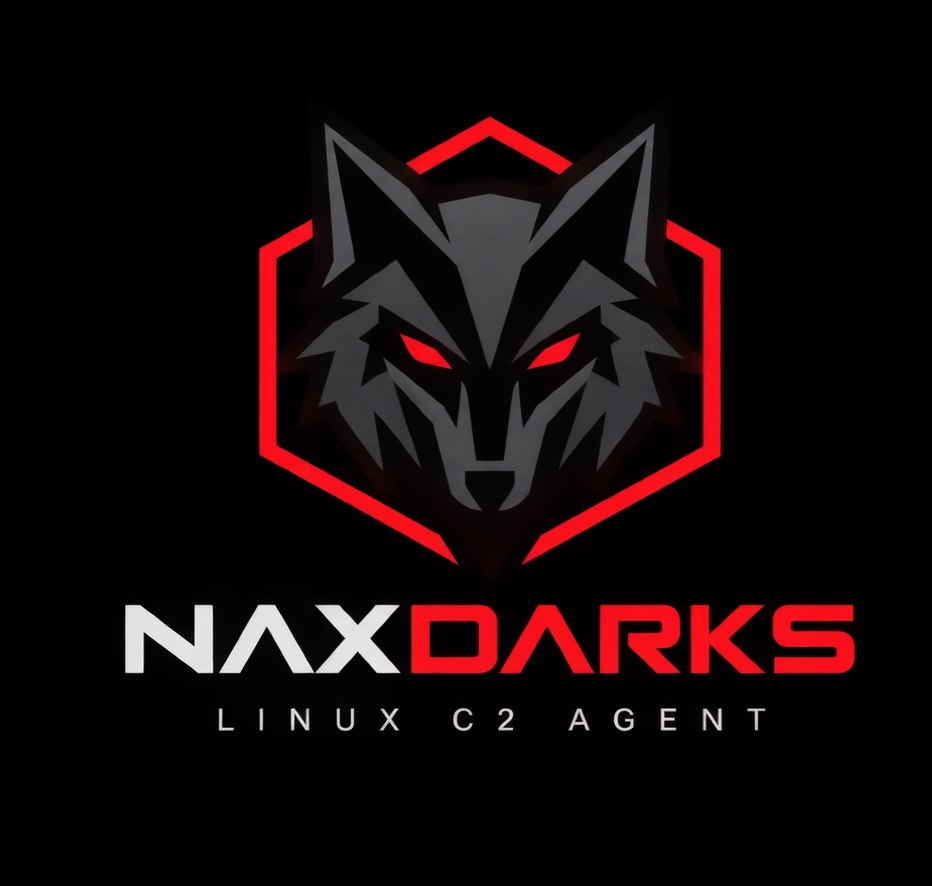

# NaxDarks



NaxDarks is a Red Team agent for Linux, built for the [Adaptix Framework](https://github.com/Adaptix-Framework/AdaptixC2/tree/main), that brings the flexibility of Beacon Object Files (BOFs) to the Linux ecosystem.

Forget depending on Python or Bash on the target machine. NaxDarks executes compiled C object files (.o) directly in memory using an in-memory ELF loader (mmap + relocate + execute), with a Beacon-style API and native support for asynchronous BOF execution. It includes malleable HTTPS transport, TCP pivoting, and a suite of ready-to-use post-exploitation BOFs.


## Features

- **HTTPS transport** - malleable C2 profile v2 with URI and host rotation, configurable sleep and jitter
- **TCP transport** - connect-out and bind/pivot modes
- **Multi-hop pivoting** - chain multiple Linux TCP bind agents through a single HTTPS parent
- **Multi-architecture** - x86_64 and ARM64
- **AES-128-CBC encryption** - all frames encrypted end-to-end
- **SOCKS4/5 proxy** and **reverse port forwarding** via Adaptix tunnel system
- **BOF execution** - In-memory execution of C object files (.o) with full Beacon-compatible API
- **Asynchronous BOFs** - background execution via threading, cooperative cancellation, and job management
- **OPSEC** - anti-debug, anti-VM, and self-destruct capabilities (compile-time optional)
- **Sleep Obfuscation** - Sensitive data only (Transport HTTPS)
- **Proxy-aware** - auto-detects system HTTP proxy and tunnels through HTTP CONNECT with Basic auth support
- **Stub packer** - ELF agent wrapped in encrypted loader, fileless execution via `O_TMPFILE + execveat`, `kernel keyring`, or `memfd_create` fallback
- **.rodata encryption** - XOR-encrypted string table for .so builds, decrypted at load time
- **Configurable pre-profile** - GET/POST URIs, headers and User-Agent set per listener

## Quick Start

### Prerequisites

```bash
# Required
sudo apt-get install gcc golang libssl-dev

# Optional — ARM64 cross-compilation
sudo apt-get install gcc-aarch64-linux-gnu
sudo dpkg --add-architecture arm64 && sudo apt-get install libssl-dev:arm64
```

### Deploy

```bash
./dist/axtool adaptix.spec ext install /path/to/NaxDarks [-f] [-d]
```
>> From the root of the Adaptix repository

```bash
# Full install
bash setup_nax.sh --server /path/to/adaptixserver/dist

# Individual plugins
bash setup_nax.sh --server /path/to/adaptixserver/dist --action agent-linux
bash setup_nax.sh --server /path/to/adaptixserver/dist --action listener-linux-tcp
bash setup_nax.sh --server /path/to/adaptixserver/dist --action listener-linux-https

# Check prerequisites
bash setup_nax.sh --server /path/to/adaptixserver/dist --action prereqs
```

>> From the root of the NaxDarks repository

## Commands

| Command | Description |
|---------|-------------|
| `whoami` | Show current user, UID, GID |
| `pwd` | Print current working directory |
| `env` | Print environment variables |
| `cd` | Change working directory |
| `ls` | List directory contents |
| `cat` | Read file contents |
| `mkdir` | Create directory |
| `rmdir` | Remove empty directory |
| `rm` | Delete file |
| `download` | Download file from target |
| `upload` | Upload file to agent machine |
| `shell` | Execute via `/bin/sh -c` |
| `ps` | List running processes |
| `kill` | Kill process by PID |
| `ifconfig` | Show network interfaces |
| `zip` | Compress file or directory into ZIP |
| `sleep` | Set beacon sleep interval in seconds (HTTPS only) |
| `bof` | Execute an ELF BOF (.o file) in-memory |
| `exit` | Terminate the agent |
| `socks` | Manage SOCKS proxy tunnel |
| `rportfwd` | Manage reverse port forwarding |
| `link` | Link to a child Linux pivot agent via TCP |
| `unlink` | Disconnect a linked pivot agent |
| `bof_async` | Execute an ELF BOF in background thread |
| `jobs` | List running async BOF jobs |
| `jobkill` | Stop a running async BOF job |
| `profile_update` | Update HTTPS malleable profile at runtime |

## BOFs

You can find a collection of more than 20 BOFs at [linux-bof](https://github.com/Loky-rt/linux-bof). 

1. Clone the repository
2. compile the BOFs
3. load the `bof.axs` script into Adaptix.

## Transports

### HTTPS

Full malleable C2 profile v2 support — configurable encoding, URI and host rotation, sleep and jitter. The profile is received dynamically from the server on the first connection.

### TCP Connect-out

Direct connection to the Adaptix Linux TCP listener. Sleep intervals are not configurable in this mode.

### TCP Bind (Pivot)

The agent listens on a local port, allowing a parent agent to connect inbound. Supports pivot chains of arbitrary depth. All child traffic is relayed by the parent during its normal beacon cycle.

---

# Warning:

Not all implemented techniques represent the best choice for robust OPSEC; feel free to keep your version private or submit a PR to help improve the agent's OPSEC level.

---

# Disclaimer

For authorized security research, penetration testing, red team operations, and security tooling development only. Use only on systems where you have explicit authorization.


---

# Acknowledgments

- [Adaptix Framework](https://github.com/Adaptix-Framework/Adaptix) -- C2 framework
- [Agent NoNameAx](https://github.com/MaorSabag/NaX) -- Windows Agent (Adaptix framework)
- [Agent Darks](https://github.com/ServiceNow/Dark-Agent) -- Linux Agent (Mythic framework)
